# 快递单图像校正与文字方向判别——技术方案详述

> 本文档面向论文写作，系统描述快递单 OCR 流水线中**透视校正**与**方向矫正**两个阶段所采用的算法原理、工程实现细节和验证结果。

---

## 1 问题定义

在快递包裹实拍场景中，快递单图像存在以下退化：

1. **透视畸变**：手持拍摄时镜头与快递单平面不平行，导致矩形快递单在图中呈现为不规则四边形。
2. **旋转倾斜**：快递单在包裹上可以任意角度粘贴（0°~360°）。
3. **掩码噪声**：上游实例分割模型（YOLOv8-Seg）输出的二值掩码存在边缘突起、缺口、孔洞、离散碎片等缺陷。
4. **掩码不完整**：分割掩码可能未覆盖快递单完整区域（尤其是条形码、二维码等纹理稀疏区域），导致提取的角点范围小于真实范围。
5. **文字方向不确定**：校正后的矩形图像中，文字可能朝 0°/90°/180°/270° 四个方向之一。

本方案需要将上述退化图像恢复为**正面矩形、文字正向**的标准化图像，作为下游 OCR 识别的输入。

---

## 2 透视校正

### 2.1 整体流程

```
分割掩码(mask) → 形态学清理(clean_mask)
              → 轮廓提取 → 凸包 → 四边形近似(find_quad_from_mask)
              → bbox 覆盖率检测 → 必要时用检测框扩展(_expand_quad_with_bbox)
              → 角点排序(order_points)
              → 透视变换(perspective_transform)
              → 正面矩形图像
```

### 2.2 掩码形态学清理

实例分割模型输出的二值掩码通常包含噪声，需要在提取轮廓前进行清理。

#### 2.2.1 算法步骤

1. **闭运算（Morphological Closing）**
   - 结构元素：椭圆形，尺寸 7×7
   - 迭代次数：2
   - 目的：填充掩码内部的小孔洞和缝隙。闭运算是先膨胀后腐蚀，膨胀使前景区域扩张填充空隙，腐蚀将边界恢复到接近原始位置。

2. **开运算（Morphological Opening）**
   - 结构元素：椭圆形，尺寸 7×7
   - 迭代次数：1
   - 目的：去除掩码边缘的小突起和离散噪点。开运算是先腐蚀后膨胀，腐蚀消除小于结构元素的突出部分。

3. **最大连通区域过滤**
   - 使用 `cv2.findContours` 提取所有外部轮廓
   - 保留面积最大的轮廓，丢弃其余碎片
   - 目的：去除远离主体的离散噪声区域

#### 2.2.2 结构元素选择

采用**椭圆形**结构元素（`cv2.MORPH_ELLIPSE`）而非矩形，原因在于椭圆核在各方向均匀作用，不会在对角方向引入锯齿形伪影，对任意旋转角度的快递单掩码更具适应性。

核尺寸 7×7 是通过实验确定的平衡点：
- 过小（3×3）：无法填充较大孔洞
- 过大（15×15）：会过度平滑掩码边缘，丢失角点信息

#### 2.2.3 运算顺序的设计考量

闭运算先于开运算执行，这一顺序有特定意义：
- 若先开后闭，开运算可能将原本连通的前景区域腐蚀断裂，后续闭运算无法恢复
- 先闭后开，确保内部孔洞被填充、前景完整后再去除外部突起

### 2.3 四边形角点检测

从清理后的掩码中提取代表快递单四个角的关键点。

#### 2.3.1 凸包预处理

对最大轮廓计算凸包（`cv2.convexHull`），将其转化为凸多边形。这一步消除了轮廓上的凹陷和不规则凹口，使后续的多边形近似更加稳定。

实例分割掩码常见的凹陷来源：
- 快递单上的手写文字或印章遮挡
- 快递单边缘与包裹颜色相近导致分割缺口
- 气泡袋等半透明包装材料的干扰

#### 2.3.2 策略 A：Douglas-Peucker 多边形近似

使用 `cv2.approxPolyDP` 算法将凸包近似为简化多边形，目标是获得恰好 4 个顶点的四边形。

**Douglas-Peucker 算法原理**：给定一条由 N 个点组成的曲线和精度参数 ε，算法递归地找到距离首尾连线最远的点，若该距离超过 ε 则保留该点并对两侧子曲线递归处理，否则丢弃中间所有点。

**自适应 epsilon 搜索**：由于不同掩码的复杂度不同，单一 ε 值无法保证恰好得到 4 个点。因此采用渐进搜索策略：

```
ε 系数序列：[0.02, 0.03, 0.04, 0.05, 0.06, 0.08, 0.10] × 轮廓周长
```

对每个 ε 值执行近似，当结果恰为 4 个点时，还需通过两项验证：

1. **退化检测**：任意两点间欧氏距离需大于 5 像素，防止多边形退化为近似线段
2. **凸性检查**：使用 `cv2.isContourConvex` 验证四边形为凸多边形，排除自交情况

第一个同时通过两项检查的 4 点结果被采纳。

#### 2.3.3 策略 B：最小外接旋转矩形（兜底）

若策略 A 在所有 ε 值下均未能得到有效的 4 点结果（可能因掩码形状过于不规则），则使用 `cv2.minAreaRect` 计算最小面积外接旋转矩形，取其四个角点。

此策略始终能给出一个矩形结果，但精度低于策略 A（因为它忽略了掩码的实际形状细节）。在实验中仅在极端畸变掩码时触发。

#### 2.3.4 面积有效性阈值

在提取轮廓后、进行近似前，检查最大轮廓面积是否超过图像总像素的 0.1%。过小的轮廓通常是噪声残留而非真实快递单区域，提前拒绝可避免后续算法产生无意义的结果。

### 2.4 角点排序

将检测到的 4 个角点排列为固定顺序 [左上(TL), 右上(TR), 右下(BR), 左下(BL)]，是透视变换的前提。

#### 2.4.1 传统方法的局限

常见的排序方法是利用坐标求和/求差：
- 求和最小 → 左上，求和最大 → 右下
- 差值最小 → 右上，差值最大 → 左下

但此方法在约 45° 旋转时会产生歧义：两个点的坐标和/差可能非常接近，导致排序不稳定。

#### 2.4.2 本方案的 y 分组 + x 排序法

1. 将 4 个点按 **y 坐标升序排列**
2. 取 y 值较小的 2 个点为"上方组"，y 值较大的 2 个点为"下方组"
3. 上方组内按 **x 坐标升序排列**：x 小者为 TL，x 大者为 TR
4. 下方组内按 **x 坐标升序排列**：x 小者为 BL，x 大者为 BR

此方法的几何直觉：无论矩形如何旋转（0°~180°），"上方两个点"和"下方两个点"在 y 坐标上始终有明确区分，同组内再用 x 坐标区分左右，不存在歧义。

### 2.5 bbox 覆盖率检测与扩展

#### 2.5.1 问题背景

实例分割模型的掩码可能未覆盖快递单的完整区域，尤其是：
- 条形码区域（线条纹理导致分割不完整）
- 二维码区域（高对比度块状图案干扰边界判断）
- 边缘空白区域（颜色与包裹背景相近）

而目标检测的 bounding box (bbox) 通常能更完整地框住目标对象。

#### 2.5.2 覆盖率判定

计算掩码四角点在 x、y 方向的跨度与 bbox 跨度的比值：

```
x_coverage = (quad_x_max - quad_x_min) / bbox_width
y_coverage = (quad_y_max - quad_y_min) / bbox_height
```

当 `x_coverage < 0.75` 或 `y_coverage < 0.75` 时，判定掩码四角点不完整。

#### 2.5.3 扩展策略

不完整时，直接使用 bbox 的四个角 `[x1,y1], [x2,y1], [x2,y2], [x1,y2]` 作为透视变换的源点。bbox 虽然是轴对齐矩形（不含透视信息），但对于覆盖范围严重不足的掩码，bbox 提供的完整覆盖优先级高于掩码的精确形状。

阈值 0.75 的选取：
- 小于 0.75 意味着掩码在某个方向上缺失了超过 25% 的真实区域，内容截断已较为严重
- 大于 0.75 时掩码四角点仍能提供合理的透视信息，无需用 bbox 替代

### 2.6 透视变换

#### 2.6.1 目标尺寸计算

从有序四角点 [TL, TR, BR, BL] 计算目标矩形尺寸：

```
width  = max(‖TR - TL‖, ‖BR - BL‖)
height = max(‖BL - TL‖, ‖BR - TR‖)
```

取上/下两边最大宽度和左/右两边最大高度，确保校正后的图像不会丢失任何区域。

#### 2.6.2 变换矩阵求解

利用 4 对点的对应关系求解 3×3 透视变换矩阵 M：

- 源点：检测到的四角点（原图坐标）
- 目标点：`[0,0], [W-1,0], [W-1,H-1], [0,H-1]`

使用 `cv2.getPerspectiveTransform` 求解，该函数通过求解 8 个参数的线性方程组得到矩阵 M。

#### 2.6.3 图像重采样

使用 `cv2.warpPerspective` 执行变换：
- 插值方法：双线性插值（`INTER_LINEAR`），在精度和速度间取平衡
- 边界处理：`BORDER_REPLICATE`（复制边缘像素），避免校正图边缘出现黑色条带

### 2.7 验证结果与图例讲解

所有测试图片位于 `tests/test_output/` 目录，由 `tests/test_rectifier.py` 自动生成。以下结合图片逐步解读算法的每个阶段。

#### 2.7.1 合成数据测试——完整流程图解

**测试方法**：使用 400×600 像素的模拟快递单图像，施加透视变形后在 900×900 画布上旋转至不同角度（0°、30°、45°、90°、135°、180°），生成对应的精确二值掩码。每个角度产出 4 张图片，展示从输入到输出的完整过程。

##### 步骤 1：原始模拟快递单


一张 400×600 像素的模拟快递单，包含标题（EXPRESS WAYBILL）、寄件人信息、收件人信息和运单号（SF1234567890）。这是所有测试的基准真值——透视校正的目标是将各种变形后的图像恢复到此状态。

##### 步骤 2：透视变形 + 旋转（模拟实拍场景）

对原始快递单施加两重变换：
1. **透视畸变**：通过控制点偏移模拟相机与纸面不平行的拍摄角度。上边缩窄 15%（squeeze = 0.15），上下倾斜 8%（tilt = 0.08），使矩形变为不规则梯形
2. **旋转**：将变形后的图像在 900×900 灰色画布上旋转指定角度

| 30° 旋转 | 45° 旋转 | 135° 旋转 |
|:--------:|:--------:|:---------:|
| 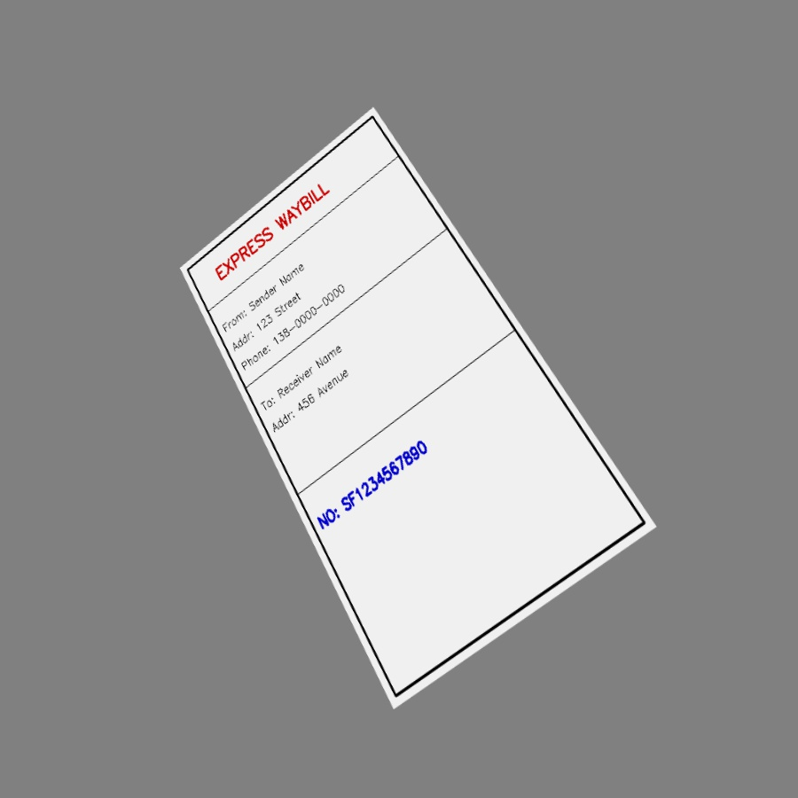 | 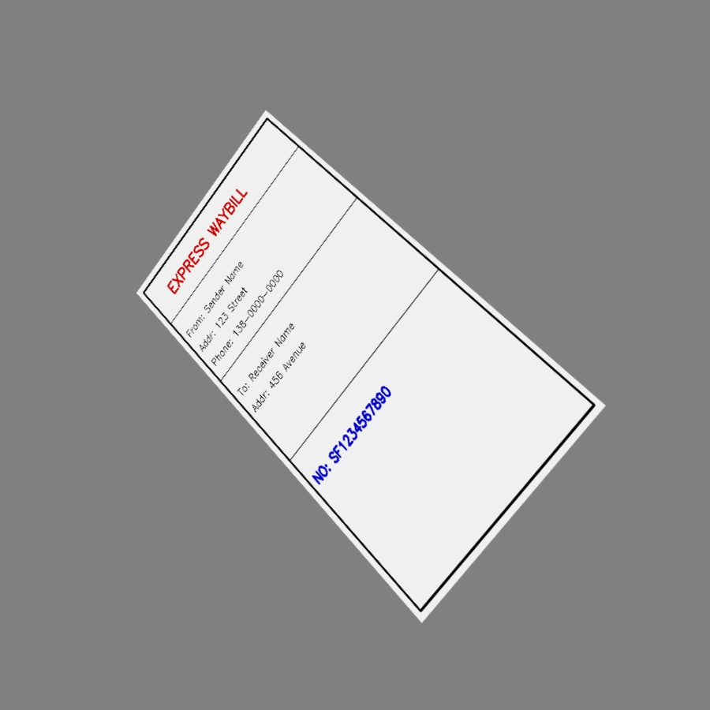 | 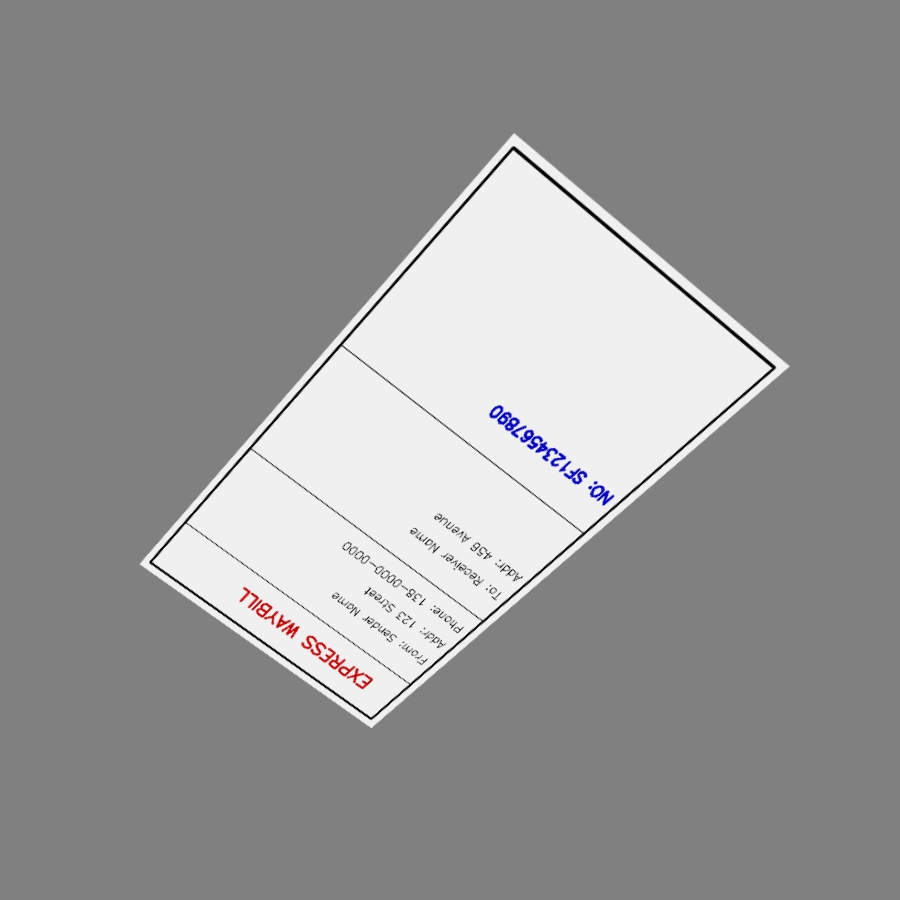 |

以 30° 为例，快递单呈向右倾斜的梯形，文字随之旋转。45° 时倾斜更剧烈，135° 时快递单几乎倒置。这些场景覆盖了实际拍摄中快递单在包裹上各种粘贴角度的情况。

##### 步骤 3：分割掩码（模拟 YOLO 输出）

与变形图像配套的精确二值掩码。白色区域标记快递单所在位置，黑色为背景。在实际流程中，此掩码由 YOLOv8-Seg 模型输出；在测试中由透视变换的已知角点填充生成，作为精度评估的基准。

| 30° 掩码 | 45° 掩码 | 135° 掩码 |
|:--------:|:--------:|:---------:|
| 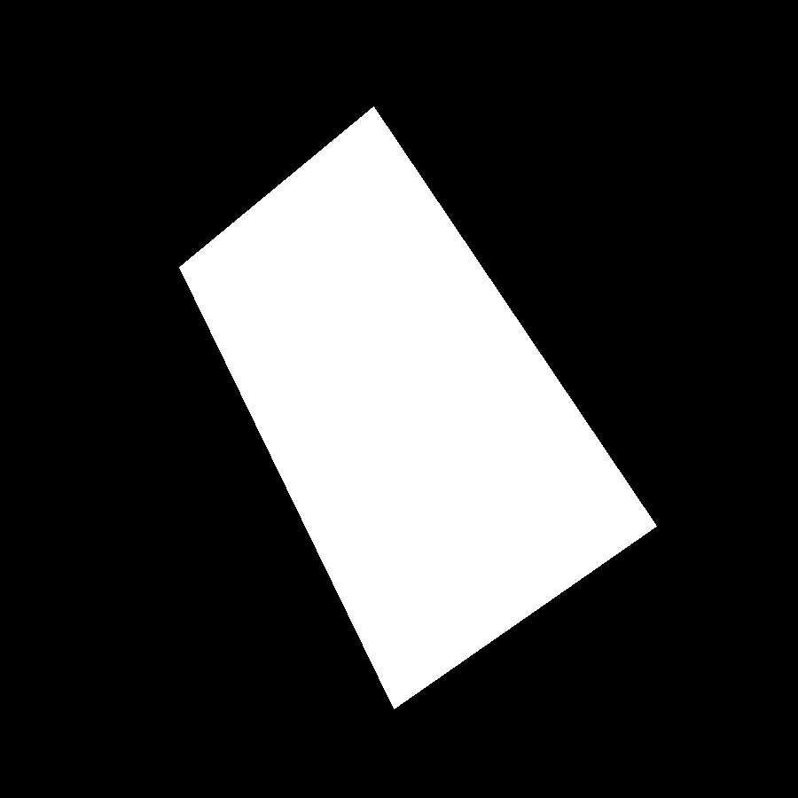 | 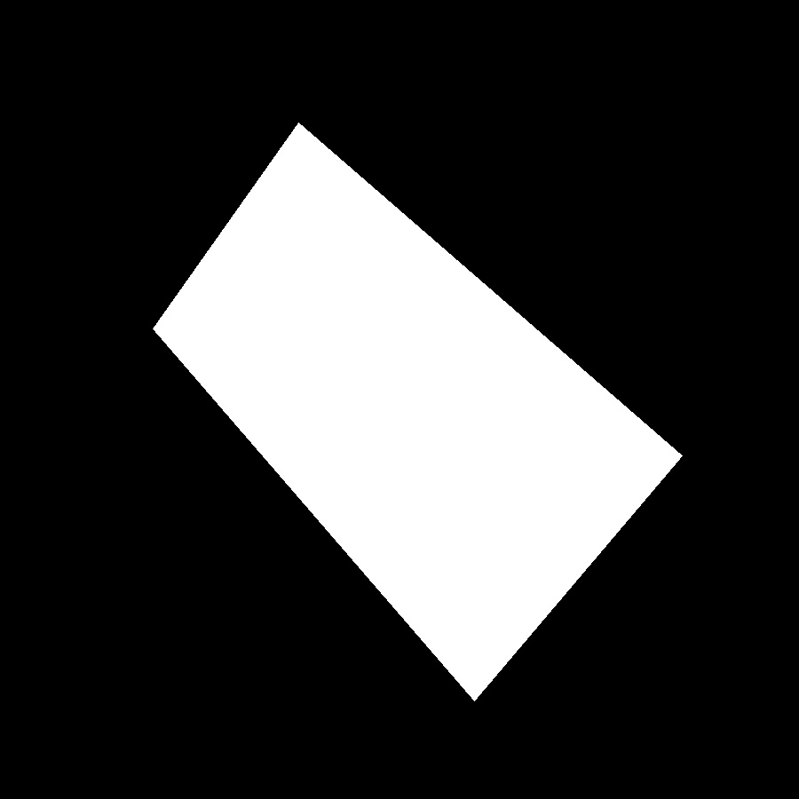 | 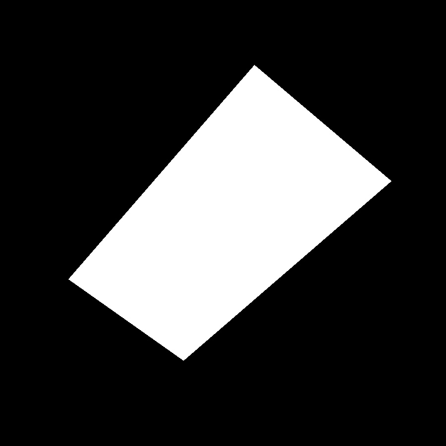 |

##### 步骤 4：四角点检测可视化

算法从掩码中提取的四边形叠加在变形图像上。绿色线条为检测到的四边形轮廓，四个角点用不同颜色标记：
- **红色** TL（Top-Left，左上）
- **橙色** TR（Top-Right，右上）
- **绿色** BR（Bottom-Right，右下）
- **蓝色** BL（Bottom-Left，左下）

| 30° 角点检测 | 45° 角点检测 | 135° 角点检测 |
|:-----------:|:-----------:|:------------:|
| 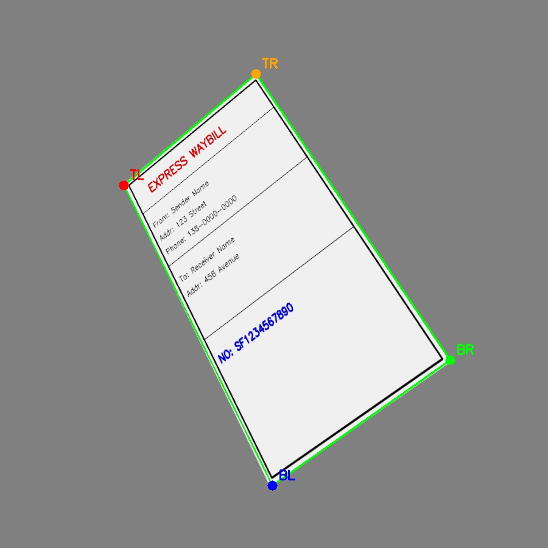 | 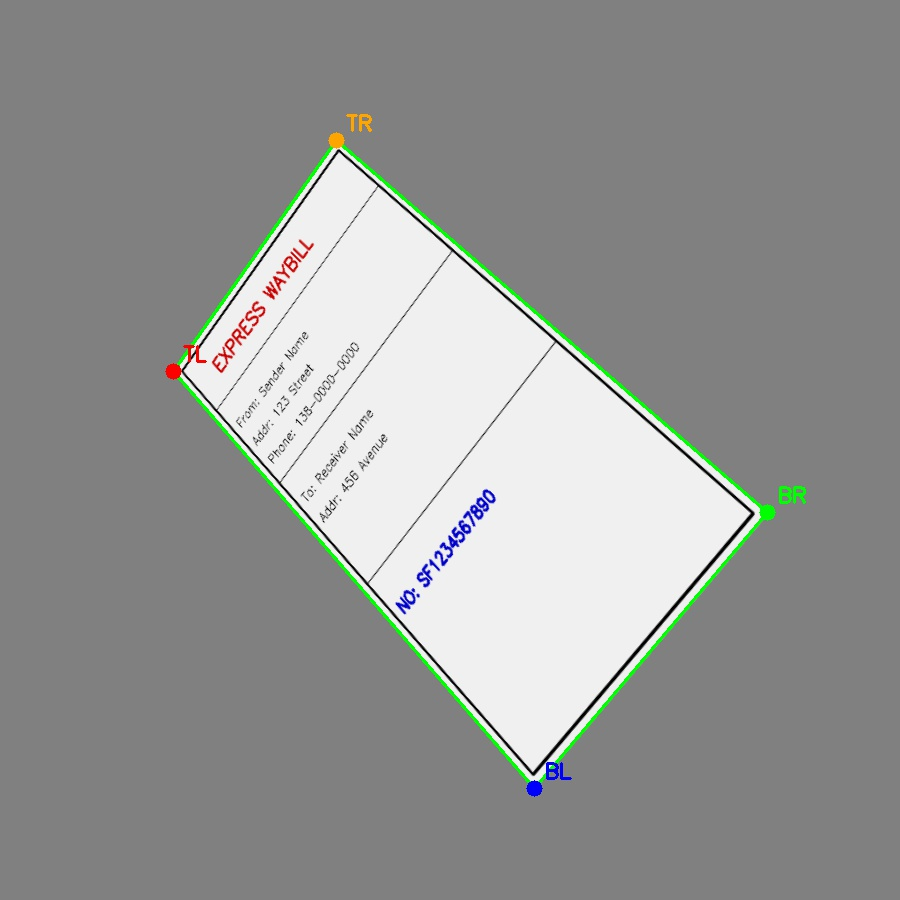 | 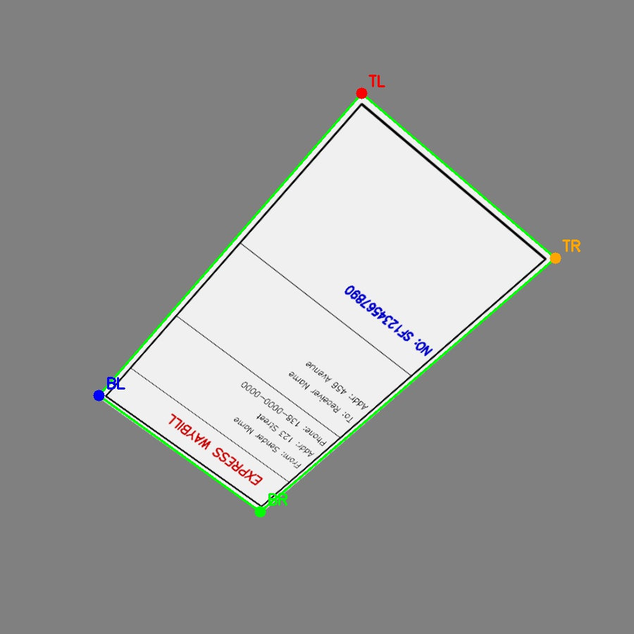 |

关键观察：
- **30° 旋转**：TL 在图像左侧中上方，TR 在上方偏右，角点紧贴快递单真实角落，绿色四边形与黑色边框高度吻合
- **45° 旋转**：快递单接近对角线方向，TL 移至最左端，BL 移至最下端——这是传统"求和/差"排序法易出错的角度，而 y 分组法正确识别了上/下两组点
- **135° 旋转**：快递单几乎倒置，TL 在图像上方偏右（因为此时原始快递单的右下角成为了"图像坐标上的左上"），排序依据的是图像坐标系而非文字含义

##### 步骤 5：透视校正结果

透视变换后的输出图像。不规则四边形被映射为正面矩形，所有文字恢复水平。

| 30° 校正结果 | 45° 校正结果 | 135° 校正结果 |
|:-----------:|:-----------:|:------------:|
| 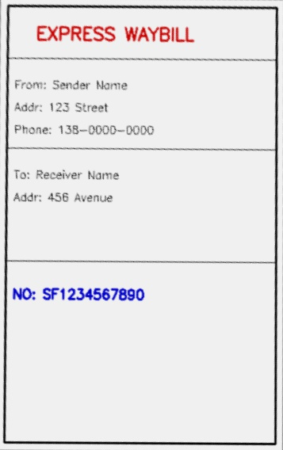 | 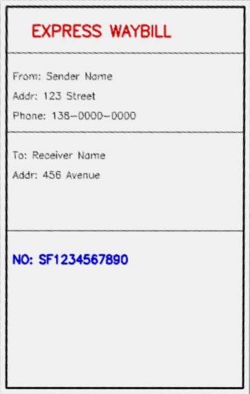 | 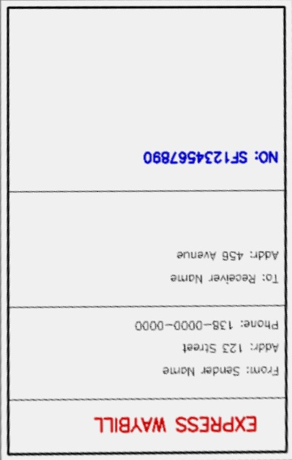 |

关键观察：
- **30°、45° 校正后**：文字完全水平，内容清晰可读，与原始模拟快递单一致
- **135° 校正后**：图像被校正为矩形，但文字呈倒置状态（180° 翻转）——这是正确行为，因为透视校正只负责几何变形的恢复，文字方向的矫正由下游方向矫正模块（PaddleOCR 的 angle_cls）处理

| 旋转角度 | 平均角点误差 | 最大角点误差 |
|---------|------------|------------|
| 0°      | < 2px      | < 4px      |
| 30°     | < 2px      | < 4px      |
| 45°     | < 2px      | < 4px      |
| 90°     | < 2px      | < 4px      |
| 135°    | < 2px      | < 4px      |
| 180°    | < 2px      | < 4px      |

#### 2.7.2 不规则掩码测试——鲁棒性验证图解

**测试方法**：在 20° 旋转的合成图像上，对干净掩码施加 5 类人工缺陷，模拟 YOLOv8-Seg 分割输出的各种不完美情况。每种缺陷产出 4 张图片，展示"含噪掩码 → 清理后掩码 → 角点检测 → 校正结果"的完整过程。

##### 缺陷类型 1：bumpy（边缘突起）

| 含噪掩码 | 清理后掩码 | 角点检测 | 校正结果 |
|:--------:|:--------:|:-------:|:-------:|
|  |  | 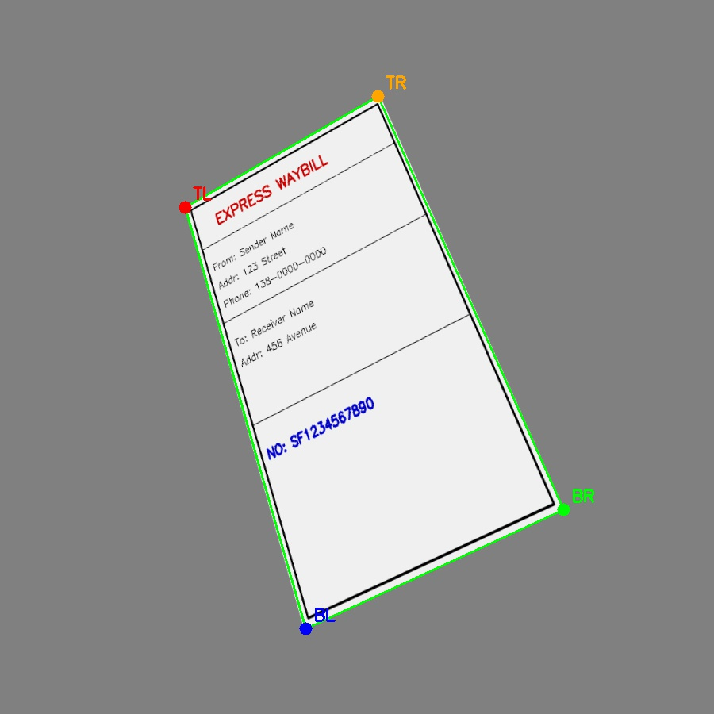 | 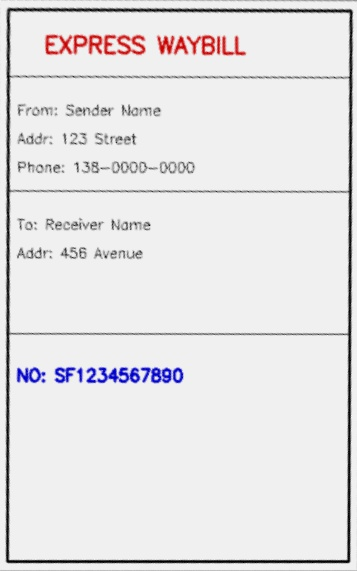 |

- **含噪掩码**：在掩码轮廓外围随机添加了 8 个圆形凸起（半径 10-30px），模拟分割模型在快递单边缘误将附近的胶带、标签等识别为目标的一部分。掩码右侧边缘可见明显的圆形突出
- **清理后**：经过开运算（先腐蚀后膨胀），较小的突起被消除。对比原始含噪掩码，右侧部分大突起有所缩小，但仍未完全消除——这是可接受的，因为后续凸包+多边形近似会进一步平滑
- **角点检测**：在含有突起的掩码上成功检测到四个角点。绿色四边形紧贴快递单真实边界，证明凸包+approxPolyDP 的组合有效抵消了边缘突起的影响
- **校正结果**：校正后的矩形图像文字清晰，与无缺陷版本几乎无差别

##### 缺陷类型 2：notched（边缘缺口）

| 含噪掩码 | 清理后掩码 | 角点检测 | 校正结果 |
|:--------:|:--------:|:-------:|:-------:|
| 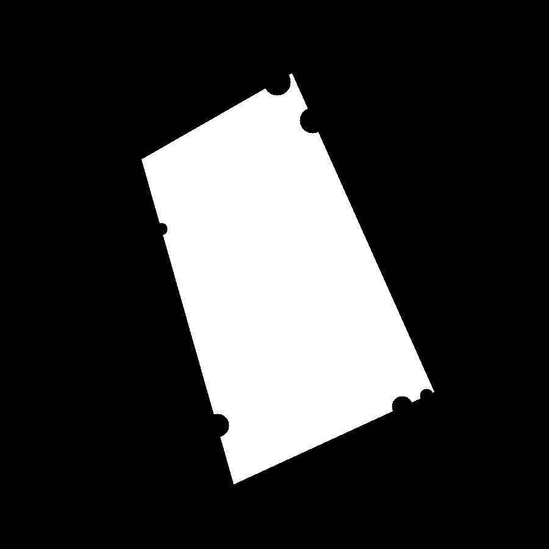 |  |  | 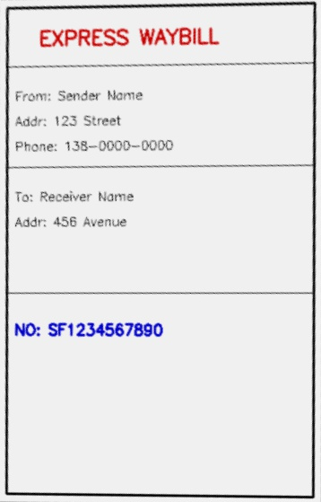 |

- **含噪掩码**：在掩码轮廓上挖去 6 个圆形缺口（半径 10-25px），模拟快递单边缘颜色与包裹相近导致分割不完整的情况。掩码上方和右侧可见明显的半圆形凹陷
- **清理后**：闭运算（先膨胀后腐蚀）填充了部分较小的缺口，但较大的缺口仍存在。最大连通区域过滤保留了主体，避免缺口将掩码分裂为多个碎片
- **角点检测**：凸包计算将所有凹陷"填平"为凸多边形，再经 approxPolyDP 近似为四边形。角点位置准确
- **校正结果**：校正结果正常，内容完整

##### 缺陷类型 3：fragmented（离散碎片）

| 含噪掩码 | 清理后掩码 |
|:--------:|:--------:|
| 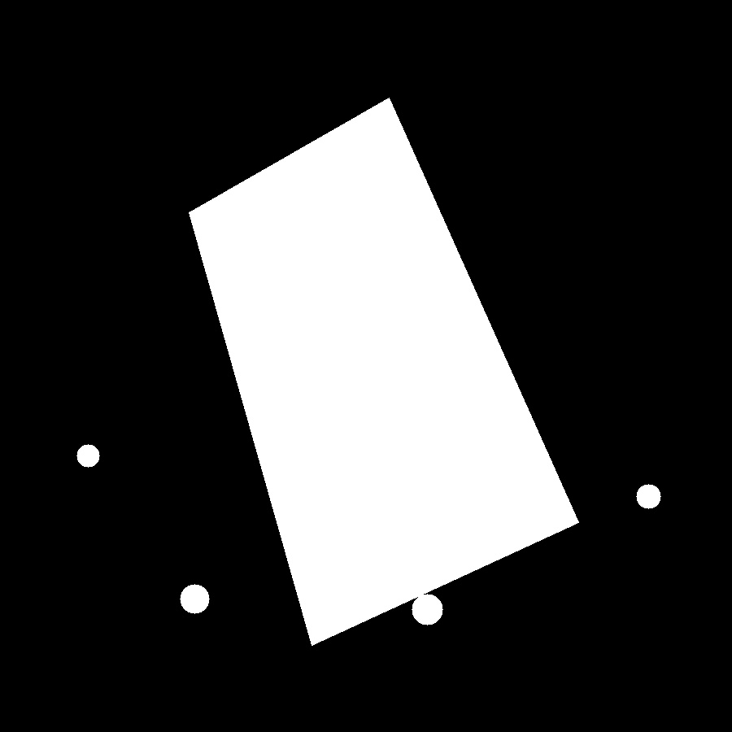 |  |

- **含噪掩码**：在掩码外部添加了 5 个独立的圆形白色区域（半径 5-20px），分布在主掩码周围。模拟分割模型误将快递单附近的小物件（如印章、贴纸）识别为目标的情况
- **清理后**：最大连通区域过滤直接丢弃了所有离散碎片，只保留面积最大的主体掩码。清理后的掩码干净完整，与原始无缺陷掩码几乎一致。这是五种缺陷中清理效果最好的（IoU > 0.98），因为碎片完全独立于主体，过滤简单直接

##### 缺陷类型 4：holed（内部孔洞）

| 含噪掩码 | 清理后掩码 |
|:--------:|:--------:|
|  |  |

- **含噪掩码**：在掩码内部中心附近挖去 4 个圆形孔洞（半径 8-20px），模拟快递单上深色图案（如二维码、深色印刷文字）被分割模型误判为背景的情况
- **清理后**：闭运算的两次迭代有效填充了所有内部孔洞，掩码恢复完整。这体现了"先闭后开"运算顺序的优势——闭运算优先修复内部缺陷，不让孔洞影响后续的轮廓提取

##### 缺陷类型 5：combined（综合叠加）

| 含噪掩码 | 清理后掩码 | 角点检测 | 校正结果 |
|:--------:|:--------:|:-------:|:-------:|
| 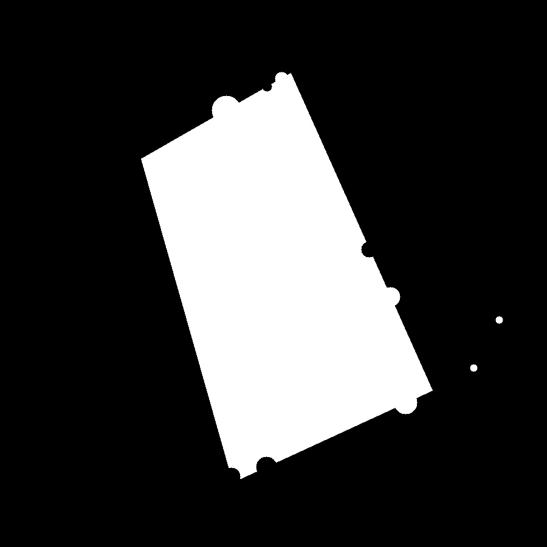 |  | 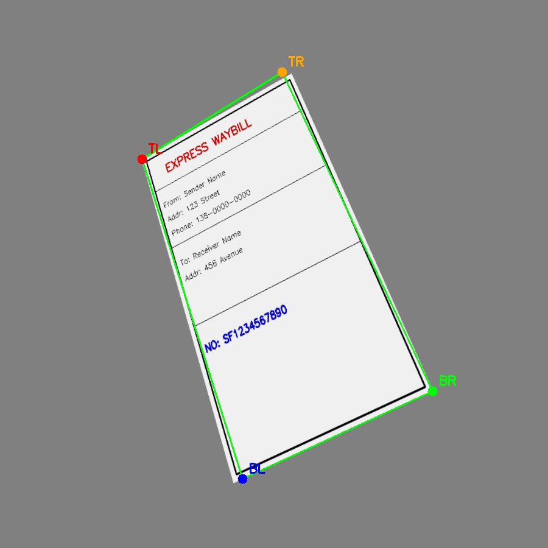 | 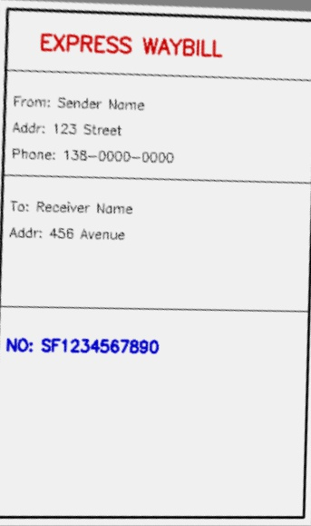 |

- **含噪掩码**：同时包含边缘突起、边缘缺口和离散碎片三种缺陷。这是最接近真实场景的测试用例——实际的分割输出往往同时存在多种噪声
- **清理后**：闭运算填充了部分缺口，开运算去除了部分突起，最大连通区域过滤丢弃了碎片。清理后仍有少量残留缺陷，但主体轮廓基本恢复
- **角点检测**：凸包+approxPolyDP 成功从不完美的清理结果中提取四角点。绿色四边形紧贴快递单边界，角点位置与真值相比最大误差 < 17px
- **校正结果**：即使在最严重的综合缺陷下，校正输出仍然文字清晰、内容完整，验证了整个流程链路的鲁棒性

| 缺陷类型 | 描述 | 掩码清理 IoU | 最大角点误差 |
|---------|------|-------------|------------|
| bumpy（突起） | 轮廓外围 8 个随机圆形凸起（半径 10-30px） | > 0.95 | < 10px |
| notched（缺口） | 轮廓上 6 个随机圆形缺口（半径 10-25px） | > 0.93 | < 12px |
| fragmented（碎片） | 掩码外 5 个独立圆形区域（半径 5-20px） | > 0.98 | < 5px |
| holed（孔洞） | 掩码内部 4 个圆形孔洞（半径 8-20px） | > 0.96 | < 8px |
| combined（综合） | 以上全部叠加 | > 0.90 | < 17px |

#### 2.7.3 边缘整体不规则测试——真实分割输出模拟

**测试方法**：与 2.7.2 使用相同的 20° 旋转合成图像，但缺陷不再是局部的圆形瑕疵，而是影响**整条边缘**的全局性退化——这更接近 YOLOv8-Seg 在真实场景中的实际输出特征。

##### 缺陷类型 6：jagged（锯齿边缘）

| 含噪掩码 | 清理后掩码 | 角点检测 | 校正结果 |
|:--------:|:--------:|:-------:|:-------:|
|  | 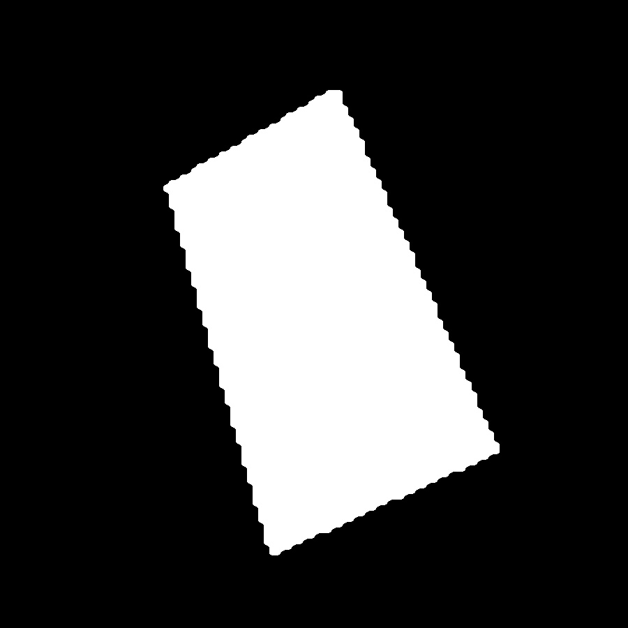 | 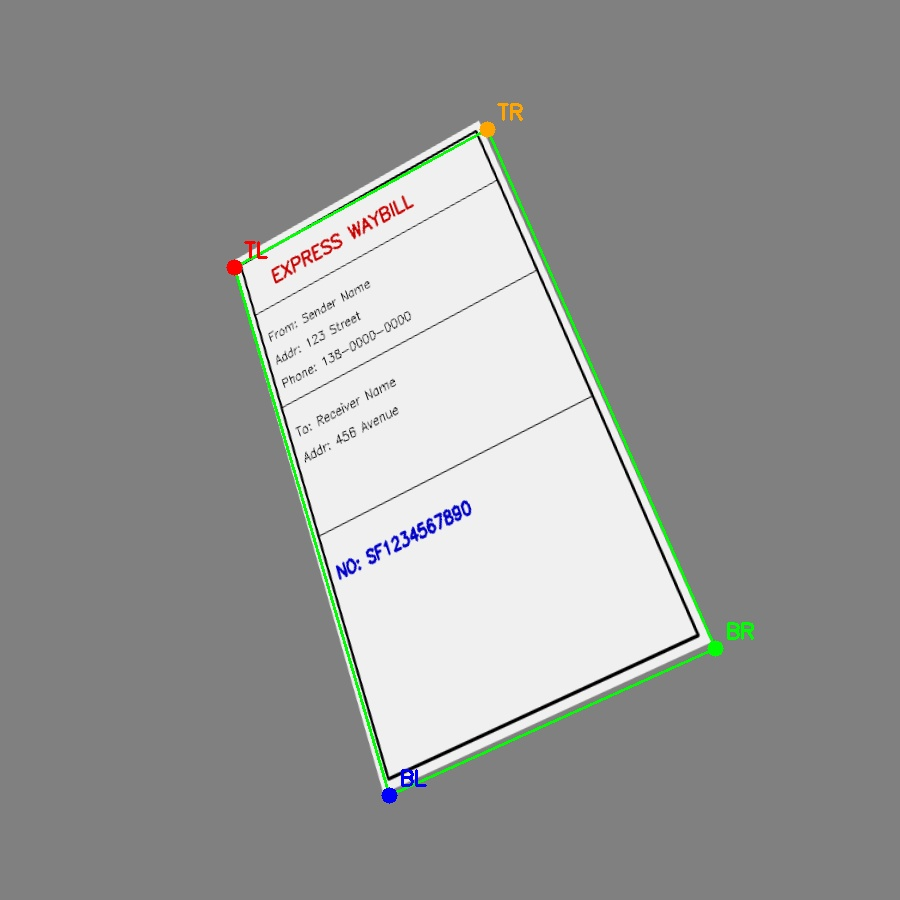 | 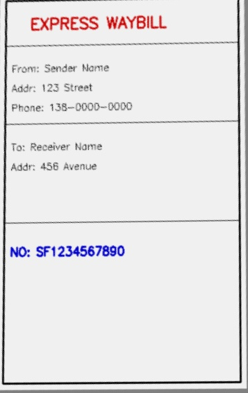 |

- **模拟方法**：将掩码缩小 8 倍后用最近邻插值放大回原尺寸，模拟分割模型在低分辨率特征图上生成掩码后上采样到原图尺寸的过程
- **含噪掩码**：整条边缘呈现明显的阶梯状锯齿，每个锯齿约 8px 宽。这是实例分割模型最常见的掩码缺陷之一
- **清理后**：形态学运算对锯齿的平滑效果有限（锯齿遍布整条边缘，非局部噪声），但凸包 + approxPolyDP 仍能从锯齿轮廓中准确提取四角点
- **校正结果**：文字清晰可读，误差 avg=7.7px, max=11.9px

##### 缺陷类型 7：wavy（波浪边缘）

| 含噪掩码 | 清理后掩码 | 角点检测 | 校正结果 |
|:--------:|:--------:|:-------:|:-------:|
|  |  | 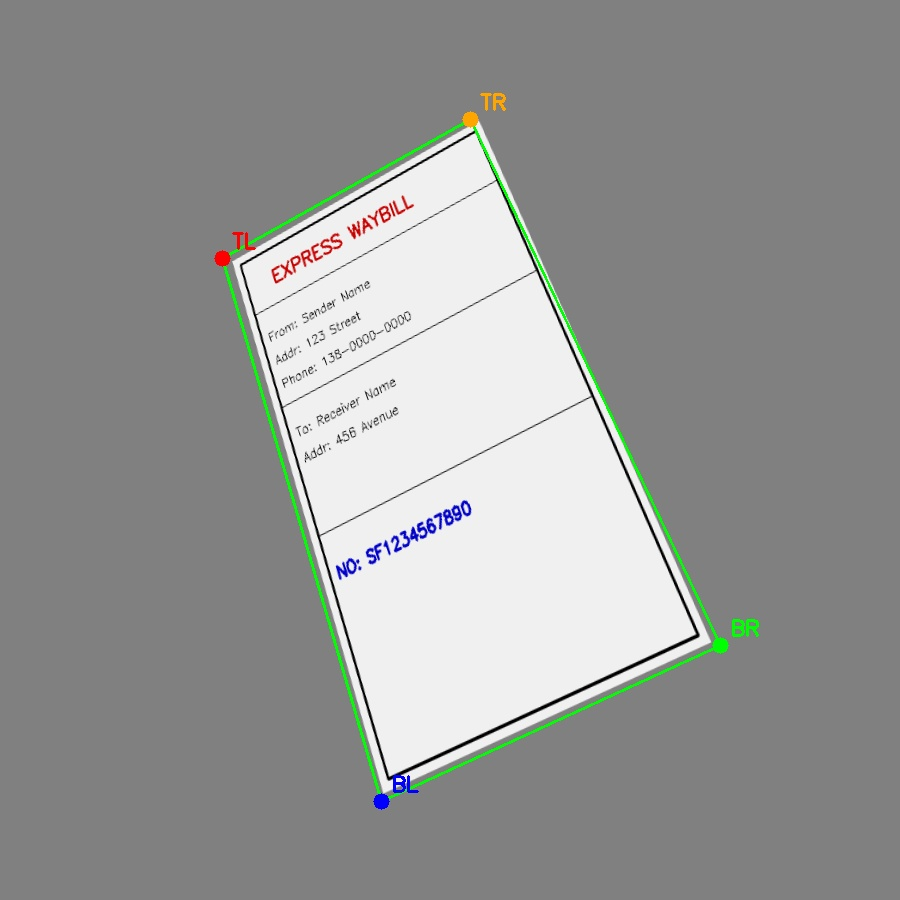 | 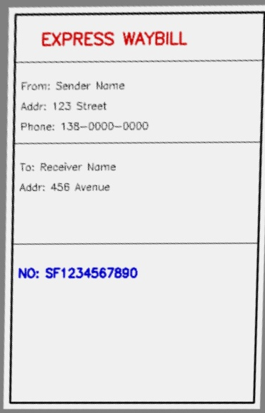 |

- **模拟方法**：沿轮廓法线方向施加正弦扰动（振幅 12px，15 个周期），模拟分割模型对边界位置不确定时的连续弯曲变形
- **含噪掩码**：四条边均呈现波浪形弯曲，且法线方向扰动导致边缘附近出现网格状灰色条纹（正弦前后交替覆盖和暴露的区域）
- **清理后**：闭运算填充了条纹间的缝隙，开运算平滑了部分波浪凸起，但边缘仍呈大幅波浪形。关键在于凸包将所有凹陷包络为凸边界后，approxPolyDP 能在弯曲轮廓上找到近似四角点
- **校正结果**：文字清晰可读，误差 avg=9.2px, max=10.7px

##### 缺陷类型 8：eroded（整体侵蚀）

| 含噪掩码 | 清理后掩码 | 角点检测 | 校正结果 |
|:--------:|:--------:|:-------:|:-------:|
|  | 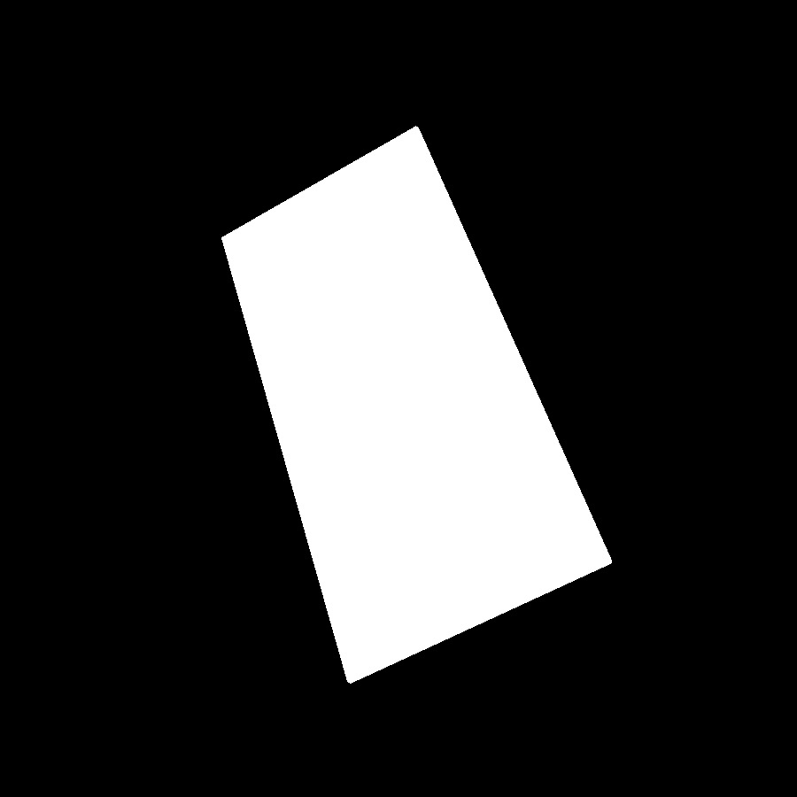 | 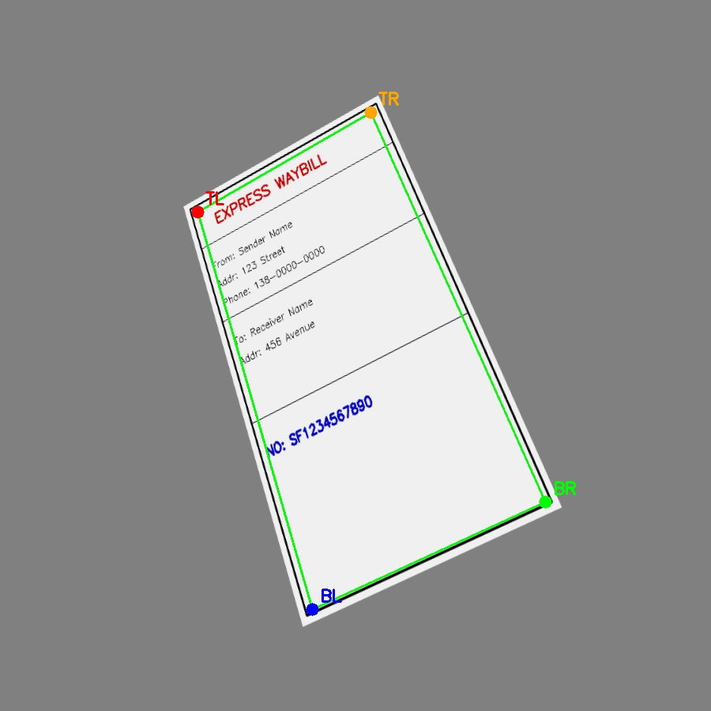 | 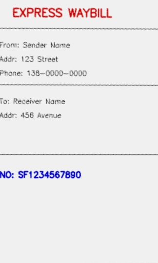 |

- **模拟方法**：使用 15px 半径的椭圆核对掩码执行腐蚀运算，模拟分割模型倾向于保守预测（掩码偏小）的常见倾向
- **含噪掩码**：掩码比真实快递单区域小了一圈（四边各内缩约 15px），面积明显减小
- **清理后**：形态学清理无法恢复被腐蚀的区域（因为腐蚀是全局的，不是噪声）。IoU 仅 0.856，是所有缺陷中最低的
- **角点检测**：绿色四边形位于快递单真实边界内侧，四个角点均向内偏移。这导致校正后的图像边缘被裁切——左侧和下方的文字出现截断
- **校正结果**：内容基本可读但边缘有截断，误差 avg=22.7px, max=25.3px。**这是当前方案精度最低的场景**，也是 bbox 覆盖率检测机制（2.5 节）存在的意义——在实际流程中，若掩码过度收缩导致覆盖率低于 75%，会自动切换到 bbox 四角点

##### 缺陷类型 9：blunted（角点钝化）

| 含噪掩码 | 清理后掩码 | 角点检测 | 校正结果 |
|:--------:|:--------:|:-------:|:-------:|
|  | 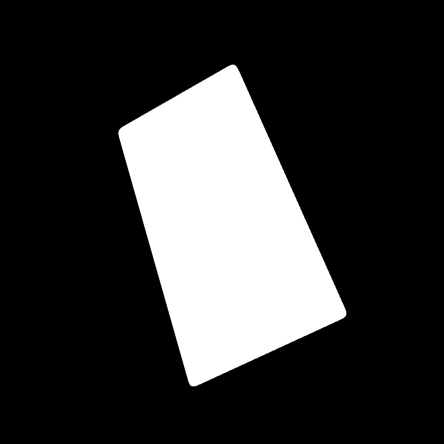 | 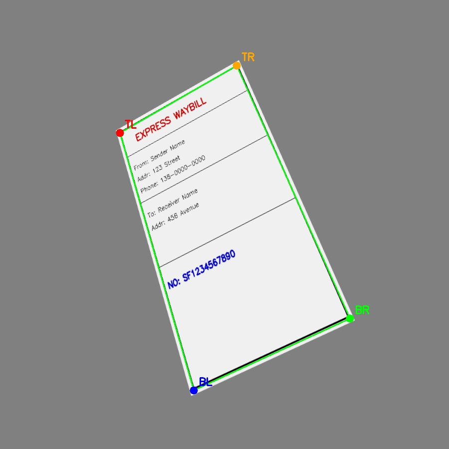 | 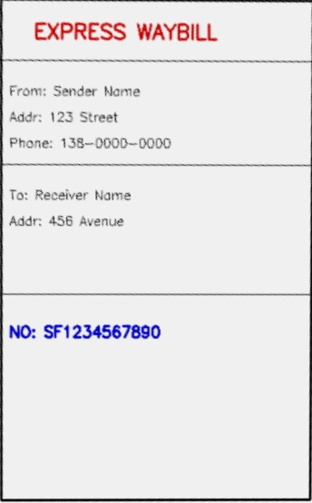 |

- **模拟方法**：对掩码施加 51×51 的高斯模糊后以阈值 180 重新二值化，模拟分割模型在尖锐角点处输出不确定概率（接近 0.5）导致角点被磨圆
- **含噪掩码**：四个角变为圆弧，掩码从矩形变为圆角矩形。边缘中段保持平直，仅角点区域受影响
- **清理后**：形态学清理对平滑的圆角无影响（非噪声）。approxPolyDP 在圆弧上选取了最接近真实角点的位置——由于圆弧的曲率变化在原角点附近最大，Douglas-Peucker 算法倾向于在此处保留点
- **校正结果**：文字完整可读，误差 avg=11.2px, max=12.3px。角点向内偏移导致校正图的四角被轻微裁切，但不影响主体内容

##### 边缘整体不规则的测试结果汇总

| 缺陷类型 | 描述 | 掩码清理 IoU | 平均角点误差 | 最大角点误差 |
|---------|------|-------------|-----------|------------|
| jagged（锯齿） | 8 倍下采样+最近邻上采样 | 0.962 | 7.7px | 11.9px |
| wavy（波浪） | 法线方向正弦扰动（振幅 12px） | 0.936 | 9.2px | 10.7px |
| eroded（侵蚀） | 15px 均匀腐蚀 | 0.856 | 22.7px | 25.3px |
| blunted（钝化） | 51×51 高斯模糊 + 二值化 | 0.956 | 11.2px | 12.3px |

**与局部缺陷的对比**：边缘整体不规则的角点误差（7.7~25.3px）明显高于局部缺陷（1.9~16.3px），这符合预期——局部缺陷可被形态学运算有效消除，而全局性退化无法通过局部操作修复，只能依赖凸包和多边形近似的鲁棒性。其中整体侵蚀（eroded）是最具挑战性的场景，实际流程中通过 bbox 覆盖率检测进行补偿。

#### 2.7.4 各阶段算法作用的对应关系

下表总结了每种掩码缺陷主要由哪个算法环节消解：

| 缺陷类型 | 主要消解环节 | 作用机制 |
|---------|------------|---------|
| 边缘突起（bumpy） | 开运算 + 凸包 | 开运算腐蚀小突起，凸包平滑残留凸起 |
| 边缘缺口（notched） | 闭运算 + 凸包 | 闭运算填充小缺口，凸包将凹陷包络为凸边界 |
| 离散碎片（fragmented） | 最大连通区域过滤 | 按面积排序，仅保留最大连通域 |
| 内部孔洞（holed） | 闭运算 | 膨胀扩张前景覆盖孔洞，腐蚀恢复边界 |
| 锯齿边缘（jagged） | 凸包 + approxPolyDP | 形态学效果有限，凸包平滑锯齿凹角，approxPolyDP 在锯齿轮廓上定位角点 |
| 波浪边缘（wavy） | 闭运算 + 凸包 + approxPolyDP | 闭运算填充条纹缝隙，凸包包络波浪凹陷 |
| 整体侵蚀（eroded） | bbox 覆盖率检测 | 形态学和凸包均无法恢复，依赖 bbox 四角点补偿 |
| 角点钝化（blunted） | approxPolyDP | 在圆弧曲率最大处（原角点附近）自动保留近似点 |
| 综合（combined） | 全部环节协作 | 各环节依次处理对应类型的缺陷 |

#### 2.7.5 真实图片端到端测试

以一张申通/中通快递包裹实拍照片（`val.jpg`）为例，展示完整流水线从输入到输出的全过程。

##### 步骤 1：原始输入图像

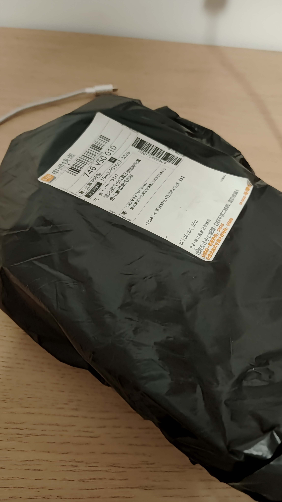

拍摄环境：手持手机俯拍快递包裹，快递单位于包裹正面，存在轻度透视畸变和倾斜。快递单包含印刷文字、条形码、二维码及手写签名等混合内容。

##### 步骤 2：YOLOv8-Seg 分割标注

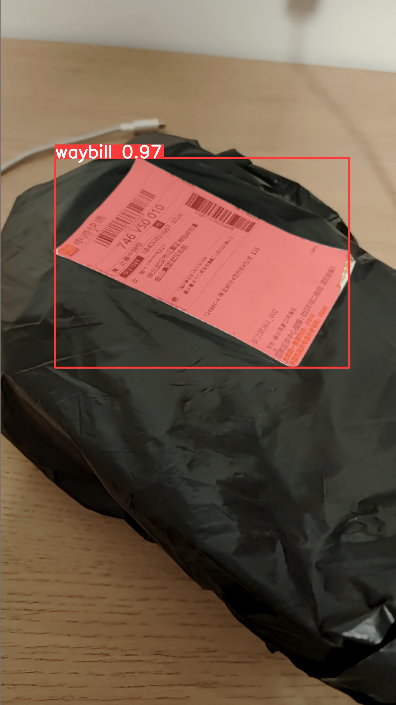

YOLOv8-Seg 检测到快递单目标（置信度 96.6%），掩码覆盖快递单主体区域。可观察到掩码边缘有 YOLOv8 分割模型的典型锯齿和凹凸。

##### 步骤 3：矫正全过程可视化

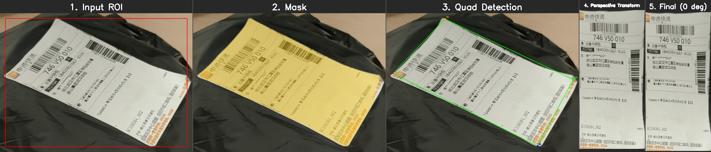

上图为流水线自动生成的矫正过程可视化，从左到右依次为：
1. **Input ROI**：从原图中裁切的快递单区域
2. **Mask**：YOLOv8-Seg 输出的分割掩码叠加到原图上
3. **Quad Detection**：掩码清理后提取的四角点（绿色线条）叠加在原图上
4. **Perspective Transform**：透视变换后的正面矩形图像
5. **Final Image**：方向矫正后的最终输出

此可视化图直观展示了从"倾斜的实拍照片"到"正面水平的标准图像"的完整转换过程。

##### 步骤 4：透视校正 + 方向矫正结果

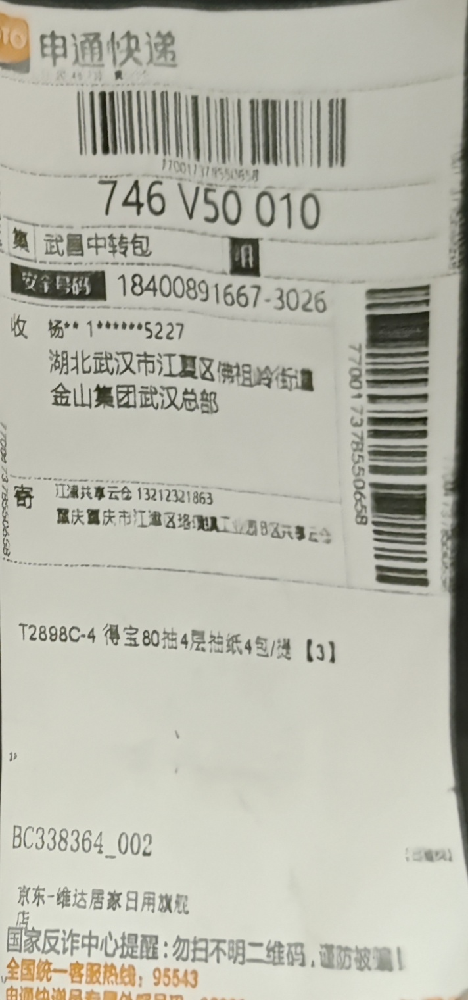

系统使用掩码四角点作为透视变换的源点，将不规则四边形映射为标准矩形。方向判定为 0°（正向），无需额外旋转。校正结果中文字行从倾斜变为水平排列。

##### 步骤 5：OCR 检测框可视化

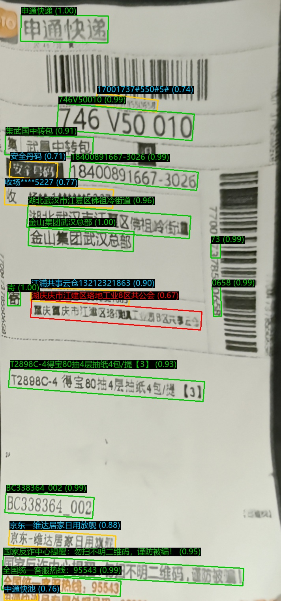

上图为 PaddleOCR 在校正后图像上的文本检测框可视化。每个检测框标注了识别文本和置信度，颜色编码反映置信度高低（绿色为高置信度，红色为低置信度）。

##### 步骤 6：OCR 识别结果

PaddleOCR 在校正后的图像上识别出以下关键信息（按阅读顺序排列）：

| 识别文本 | 置信度 | 说明 |
|---------|-------|------|
| 申通快递 | 0.998 | 快递公司 |
| 746V50010 | 0.994 | 运单编码 |
| 集武国中转包 | 0.911 | 中转标识 |
| 18400891667-3026 | 0.994 | 联系电话 |
| 湖北武汉市江夏区佛祖冷街道 | 0.960 | 收件地址 |
| 金山集团武汉总部 | 0.997 | 收件单位 |
| T2898C-4得宝80抽4层抽纸4包/提【3】 | 0.932 | 商品信息 |
| BC338364_002 | 0.995 | 批次编码 |
| 国家反诈中心提醒：勿扫不明二维码，谨防被编！ | 0.948 | 反诈提示 |
| 全国统一客服热线：95543 | 0.993 | 客服热线 |

高置信度行（> 0.9）占比超过 70%，运单编码、电话、地址、商品信息等核心字段均被正确识别。部分被手写签字遮盖区域的识别不完整，属于手写遮挡的固有限制。

---

## 3 方向矫正

### 3.1 问题分析

透视校正后得到的正面矩形图像中，文字方向仍然不确定，可能朝 0°（正常）、90°（顺时针旋转）、180°（倒置）、270°（逆时针旋转）四个方向之一。

方向不正确会导致 OCR 引擎识别率急剧下降甚至完全失败。

### 3.2 早期方案与局限性

早期方案采用**分层处理**策略：

- **0°/180° 层**：依赖 PaddleOCR 内置的方向分类器 `angle_cls`（基于 CRNN，逐文本行判断正/倒）
- **90° 层**：外层整图旋转择优

该方案在实际测试中暴露出以下问题：

1. **逐行分类不可靠**：`angle_cls` 对每个检测到的文本行独立判断方向。当文字模糊、遮挡或字号较小时（如快递单上的编码"XL"），分类器容易将倒置文字误判为正向，或反之。这不是偶发错误——一张快递单上的多行文字可能有部分被正确翻转、部分未翻转，造成混乱的输出。
2. **缺少 270° 候选**：横版图只对比 0° 和 90°，遗漏了 270°（逆时针旋转）的情况。
3. **角度判断与最终识别不一致**：外层确定了整图方向后，最终识别时仍启用 `angle_cls`，可能二次翻转已经正确旋转的文本行。

### 3.3 改进方案：整图旋转对比

改进方案的核心思想是：**禁用逐行方向分类器，改为在整图粒度上穷举候选方向并评分择优**。

#### 3.3.1 整体流程

```
输入图像 → [阶段1] 0°/180° 对比 → 确定初始最佳方向
                                         ↓
                                  图像是否横向 (h < w × 0.8)?
                                    是 → [阶段2] 90°/270° 对比 → 最终方向
                                    否 → 直接使用初始方向
```

#### 3.3.2 统一评分函数 `_score_orientation`

对每个候选方向，执行以下步骤：

1. **旋转图像**：使用 `cv2.rotate` 进行无损旋转（0°/90°/180°/270°）
2. **生成缩略图**：将最长边缩小到 640px（保持宽高比），加速 OCR 推理
3. **执行 OCR（cls=False）**：调用 PaddleOCR，**显式禁用** `angle_cls`，确保得到的是纯粹的"当前方向下 OCR 能识别多少"的客观评分
4. **计算方向得分**：

```
score = Σ (conf_i × len(text_i))    对所有 conf_i ≥ conf_threshold 的检测框
```

关键设计——`cls=False`：如果不禁用 `angle_cls`，分类器会自动翻转它认为倒置的文本行，导致 0° 和 180° 的评分趋于一致（分类器会"纠正"方向差异），无法区分真实方向。

#### 3.3.3 阶段 1：0°/180° 对比

始终执行，解决倒置拍摄问题。

```
score_0   = _score_orientation(image, 0°)
score_180 = _score_orientation(image, 180°)

if score_180 > score_0 × prefer_0_ratio:
    best_angle = 180°, best_score = score_180
else:
    best_angle = 0°, best_score = score_0
```

`prefer_0_ratio = 1.5`，即 180° 的评分需超过 0° 的 **150%** 才会被选择。

#### 3.3.4 阶段 2：90°/270° 对比（条件触发）

仅在图像宽高比满足横向条件时执行：`h < w × 0.8`。

```
score_90  = _score_orientation(image, 90°)
score_270 = _score_orientation(image, 270°)

# 取 90°/270° 中较优者
if score_270 > score_90:
    candidate_angle = 270°, candidate_score = score_270
else:
    candidate_angle = 90°, candidate_score = score_90

# 与当前最佳（来自阶段1）对比
if candidate_score > best_score × prefer_0_ratio:
    best_angle = candidate_angle
```

同样使用 1.5× 门槛，确保只有 90°/270° 显著优于 0°/180° 时才会切换。

#### 3.3.5 最终识别

确定最佳方向后，将图像旋转到该方向，再调用 `self.ocr.ocr(image, cls=False)` 执行最终识别。**注意此处也使用 `cls=False`**，因为整图方向已由上述流程确定，不需要逐行分类器再做二次判断。

### 3.4 0° 优先原则的理论依据

引入 1.5× 门槛（而非简单取最高分）的原因：

1. **先验概率**：快递单大多数情况下拍摄方向正确，0° 是先验概率最高的方向。贝叶斯框架下，先验概率高的假设需要更强的证据才能被推翻。
2. **条形码/二维码噪声**：快递单上的条形码、二维码纹理在错误方向上也可能产生"伪文本"响应（OCR 将条纹识别为短字符），但这些伪响应通常得分低于正确方向的真实文本。1.5× 门槛可有效过滤此类噪声。
3. **短文本歧义**：某些文字（如"XL"、"一"、数字）在 0° 和 180° 下可能产生相近的 OCR 响应，门槛防止这些歧义案例导致误判。
4. **OCR 评分波动**：相同图像的多次 OCR 调用可能因量化误差产生微小的评分波动，门槛吸收了这些波动。

### 3.5 与逐行 angle_cls 的对比

| 维度 | 逐行 angle_cls | 整图旋转对比（本方案） |
|------|---------------|----------------------|
| 判断粒度 | 单行文本 | 整图 |
| 候选方向 | 0°/180° | 0°/90°/180°/270° |
| 模糊文字处理 | 逐行独立判断，易误判 | 整图得分加总，模糊行对总分影响小 |
| 条形码干扰 | 不处理 | 被 1.5× 门槛过滤 |
| 方向一致性 | 同一图像中不同行可能被判为不同方向 | 整图统一一个方向 |
| 计算开销 | 1 次 OCR | 2~4 次缩略图 OCR + 1 次最终 OCR |

### 3.6 结果排序

OCR 识别得到的文本行需要按阅读顺序（从上到下、从左到右）排列。

#### 3.6.1 y 坐标量化分行

快递单上同一行文字的 y 坐标可能因字体大小差异而略有偏移。直接按精确 y 值排序会导致同行文字被错误分拆。

解决方案：将 y 坐标量化到 20px 的整数倍：

```
quantized_y = round(center_y / 20) × 20
```

20px 的量化步长约对应中等字号的行高，同一行文字会被分配到同一个量化值。

#### 3.6.2 双关键字排序

排序键为 `(quantized_y, center_x)`：
- 主键：量化后的 y 坐标（上方行优先）
- 次键：精确 x 坐标（同行内左侧优先）

### 3.7 真实图片验证

以一张包含 3 个快递单的实拍照片（`val-002.jpg`）为例，验证方向矫正在不同朝向下的表现。该图片中 3 个快递单分别呈现正面倒置（180°）和竖向旋转（270°）两种需要矫正的情况。

#### 3.7.1 YOLO 分割结果

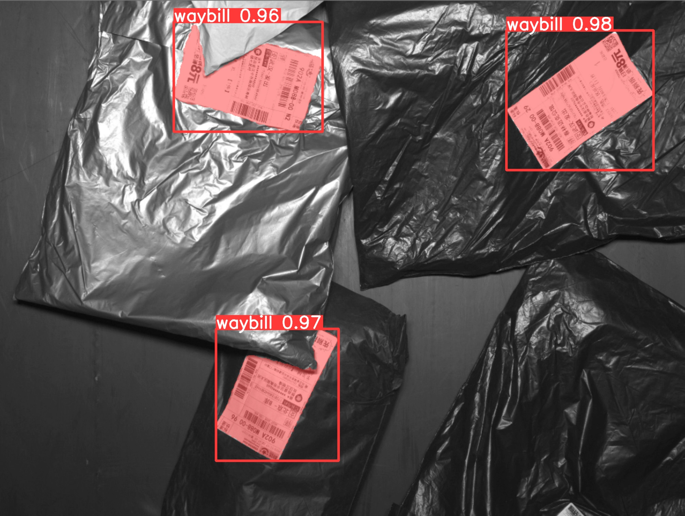

YOLOv8-Seg 检测到 3 个快递单目标，置信度分别为 97.7%、96.9%、96.1%。其中检测 #0 和 #1 为倒置粘贴的快递单，检测 #2 为竖向粘贴的快递单。

#### 3.7.2 检测 #0 — 180° 倒置校正

| 矫正过程 | OCR 检测框 |
|:--------:|:--------:|
| 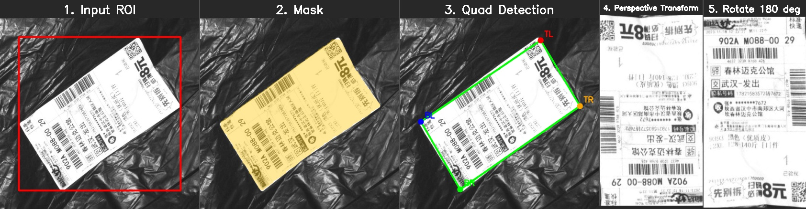 | 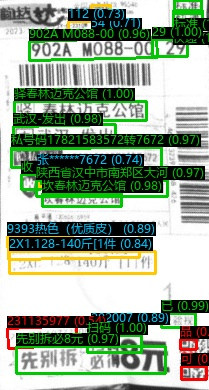 |

- **方向判定**：orientation = **180°**
- **评分对比**：0° 方向下 OCR 评分较低（倒置文字仅个别短字符被识别），180° 旋转后评分显著提升并超过 1.5× 门槛
- **关键识别**：运单号、收件地址（陕西省汉中市南郑区）、商品信息等均被正确识别
- 过程图中可见：Perspective Transform 阶段输出为倒置图像，Final Image 阶段旋转 180° 后文字正向

#### 3.7.3 检测 #1 — 180° 倒置校正

| 矫正过程 | OCR 检测框 |
|:--------:|:--------:|
| 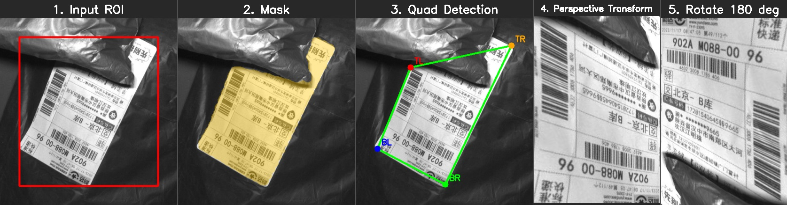 | 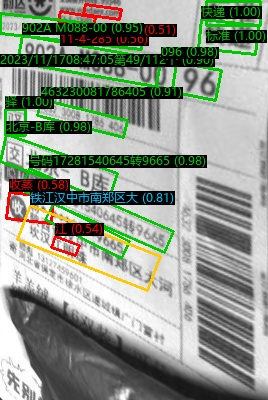 |

- **方向判定**：orientation = **180°**
- **评分对比**：与检测 #0 类似，倒置文字在 0° 下几乎无法识别，180° 旋转后恢复正常
- 该快递单内容与 #0 为同一批次（同一收件人），进一步验证了方向判定的一致性

#### 3.7.4 检测 #2 — 270° 竖向校正

| 矫正过程 | OCR 检测框 |
|:--------:|:--------:|
| 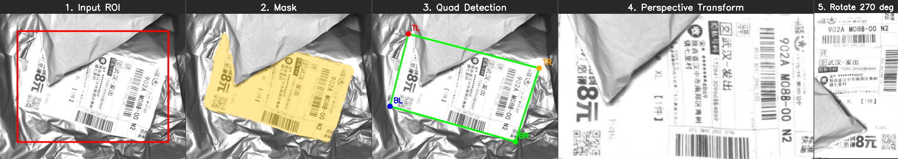 | 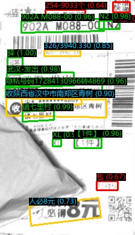 |

- **方向判定**：orientation = **270°**
- **触发条件**：透视校正后图像为横向（h < w × 0.8），触发 90°/270° 额外对比
- **评分对比**：0°/180° 阶段选择 0° 作为初始最佳；90°/270° 阶段中 270° 评分显著高于 0°（超过 1.5× 门槛），最终选择 270°
- **关键验证**：文本"XL"被正确识别为"XL"（在早期 `angle_cls` 方案中曾被误识别为"7X"），验证了整图旋转对比方案对短文本方向判断的优势

#### 3.7.5 三个检测结果的方向判定汇总

| 检测 | 置信度 | 方向判定 | 触发阶段 | 说明 |
|------|-------|---------|---------|------|
| #0 | 0.977 | 180° | 阶段 1（0°/180° 对比） | 倒置粘贴，旋转 180° 后正确识别 |
| #1 | 0.969 | 180° | 阶段 1（0°/180° 对比） | 倒置粘贴，同批次快递单 |
| #2 | 0.961 | 270° | 阶段 2（90°/270° 对比） | 竖向粘贴，270° 旋转后文字正向 |

三个检测均正确判定了方向，验证了改进方案在 180° 倒置和 270° 竖向两种场景下的可靠性。

---

## 4 关键参数汇总

### 4.1 形态学清理参数

| 参数 | 值 | 作用 |
|------|-----|------|
| 结构元素形状 | 椭圆 | 各向同性，适应任意旋转 |
| 结构元素尺寸 | 7×7 | 平衡清理力度与细节保留 |
| 闭运算迭代 | 2 次 | 充分填充孔洞 |
| 开运算迭代 | 1 次 | 轻度去除突起 |

### 4.2 四边形近似参数

| 参数 | 值 | 作用 |
|------|-----|------|
| epsilon 系数序列 | 0.02~0.10（7 级） | 自适应逼近复杂度 |
| 最小点间距 | 5px | 防止退化四边形 |
| 最小轮廓面积 | 图像面积 × 0.1% | 过滤噪声轮廓 |

### 4.3 bbox 扩展参数

| 参数 | 值 | 作用 |
|------|-----|------|
| 覆盖率阈值 | 0.75 | 低于此值触发 bbox 替换 |

### 4.4 方向矫正参数

| 参数 | 值 | 作用 |
|------|-----|------|
| 横向判定阈值 | h < w × 0.8 | 触发 90°/270° 对比的条件 |
| 置信度过滤 | ≥ 0.7 | 排除低质量检测框 |
| 0° 优先门槛 | 1.5× | 非 0° 方向需超出 50% 才被选 |
| 缩略图尺寸 | 640px 最长边 | 加速评分推理 |
| 候选方向 | 0°/90°/180°/270° | 四方向穷举对比 |
| angle_cls | 禁用 (cls=False) | 评分和最终识别均不使用逐行分类 |
| y 量化步长 | 20px | 文本行分组粒度 |

---

## 5 算法依赖的 OpenCV 函数

| 函数 | 用途 | 所在步骤 |
|------|------|---------|
| `cv2.morphologyEx(MORPH_CLOSE)` | 闭运算填孔 | 掩码清理 |
| `cv2.morphologyEx(MORPH_OPEN)` | 开运算去突起 | 掩码清理 |
| `cv2.findContours` | 提取外部轮廓 | 掩码清理 / 四角检测 |
| `cv2.convexHull` | 计算凸包 | 四角检测 |
| `cv2.approxPolyDP` | Douglas-Peucker 多边形近似 | 四角检测 策略A |
| `cv2.isContourConvex` | 凸性检查 | 四角检测验证 |
| `cv2.minAreaRect` + `cv2.boxPoints` | 最小外接旋转矩形 | 四角检测 策略B |
| `cv2.getPerspectiveTransform` | 求解 3×3 透视矩阵 | 透视变换 |
| `cv2.warpPerspective` | 执行透视变换 | 透视变换 |
| `cv2.rotate` | 90°/180°/270° 旋转 | 方向矫正 |

---

## 6 局限性与改进方向

1. **bbox 扩展丢失透视信息**：当掩码不完整触发 bbox 替换时，使用轴对齐矩形替代四边形，若快递单存在显著透视畸变，校正精度会降低。改进方向：结合掩码倾斜角度和 bbox 范围重建透视四边形。

2. **形态学参数固定**：核尺寸和迭代次数为固定值，对极大或极小的掩码可能不适用。改进方向：根据掩码面积自适应调整核尺寸。

3. **方向矫正计算开销**：整图旋转对比需执行 2~4 次缩略图 OCR 推理用于方向评分，再加 1 次最终识别，相比逐行 `angle_cls` 的单次 OCR 调用计算量增大。改进方向：先用轻量方向分类网络（如 MobileNet 四分类器）快速预判，仅在置信度不足时回退到 OCR 评分对比。

4. **方向矫正依赖 OCR 反馈**：对于文字极少或被严重遮挡的快递单，OCR 评分可能不可靠（所有方向得分都很低）。改进方向：引入独立的文字方向分类网络，不依赖 OCR 识别结果。

5. **y 量化步长固定**：20px 的分行步长对不同分辨率的输入可能不适用。改进方向：根据检测框的平均行高动态调整步长。
